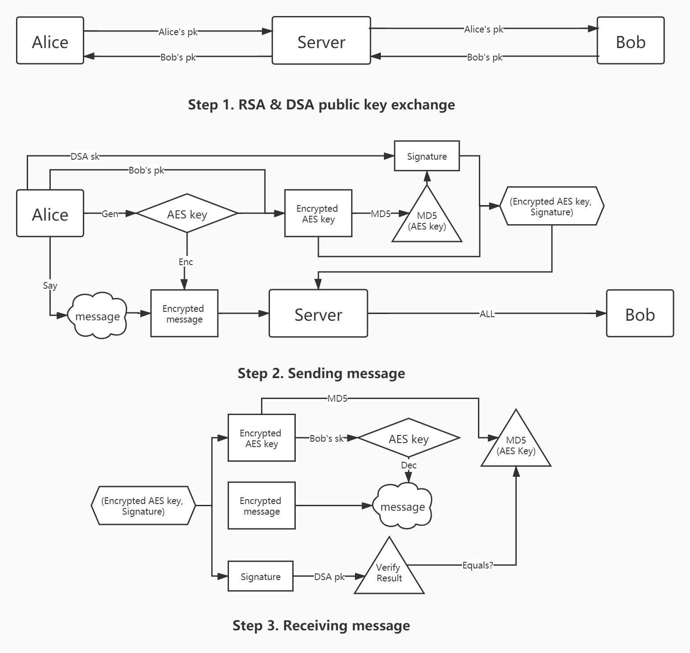
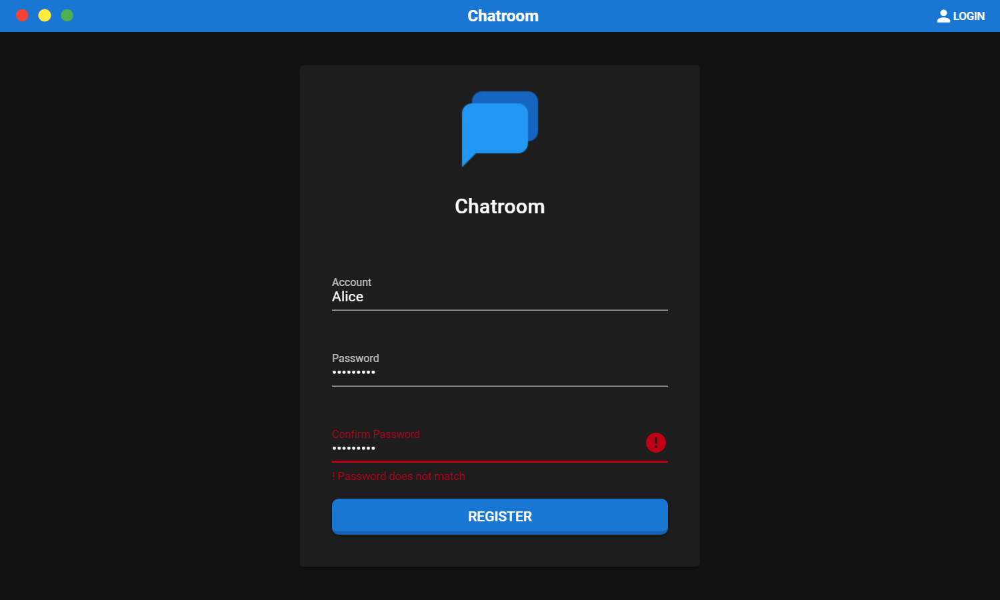
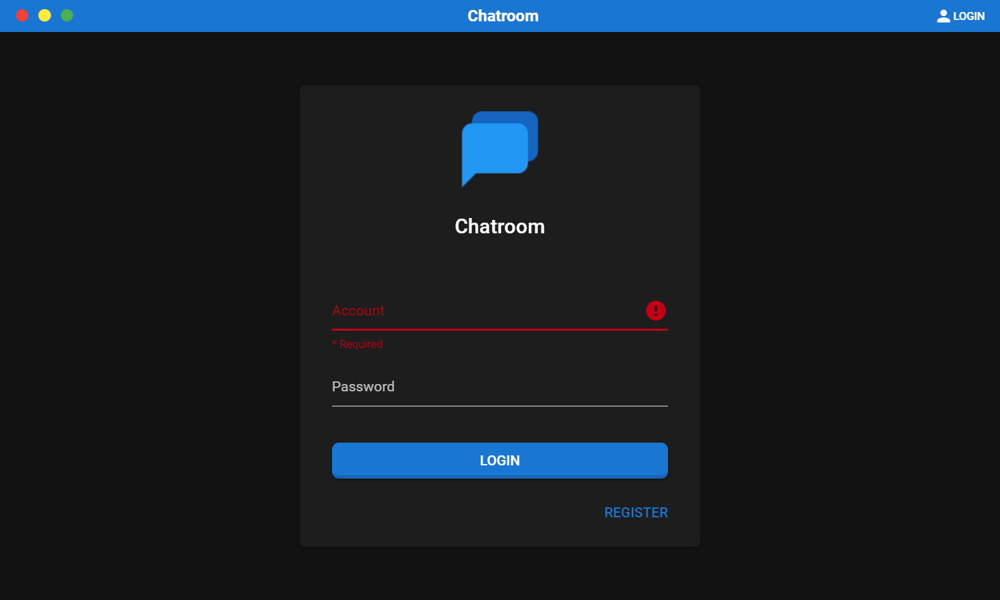
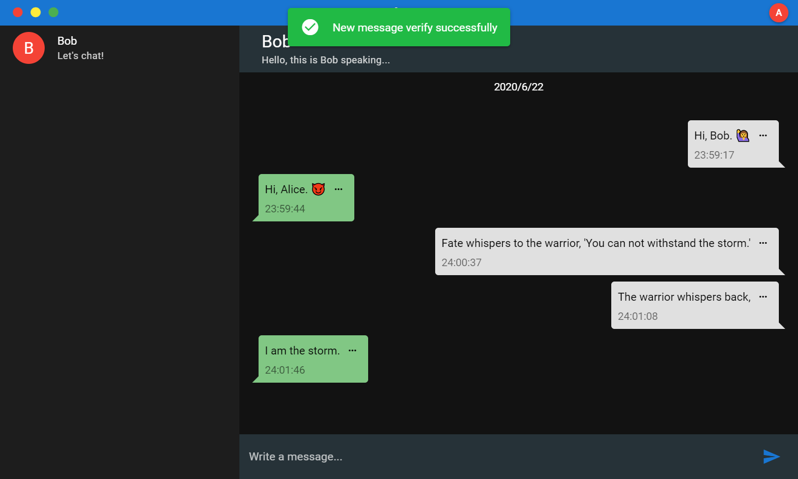
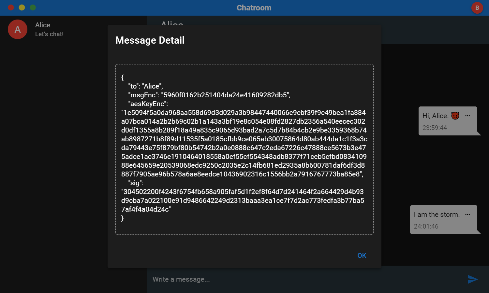

# Final

Implement a chatroom where users' messages are protected by AES, RSA, SHA1 and ECDSA.

## Steps

Here's a simple illustration:

## Features

- Account Register / Login / Logout
- RSA / ECDSA keygen, with private key stored encrypted
- Sending `msg`
  - AES keygen (aes-256-cbc, iv=0) => `aesKey`
  - AES encrypt `msg` => `msgEnc`
  - Encrypt `aesKey` with Receiver's RSA public key => `aesKeyEnc`
  - Sign (ECDSA + SHA1) `aesKeyEnc` with Sender's ECDSA private key => `sig`
  - Send `(msgEnc, aesKeyEnc, sig)`
- Receiving `(msgEnc, aesKeyEnc, sig)`
  - Verify `aesKeyEnc` with Sender's ECDSA public key and `sig`.
    - If invalid, discard the message and abort
    - If valid, go on
  - Decrypt `aesKeyEnc` with Receiver's RSA private key => `aesKey`
  - Decrypt `msgEnc` with `aesKey` => `msg`
- Show when the message is delivered
- Show message detail

## Design

1. How to ensure that Step 1 is done before chatting?

   > Solution:
   > (Deprecated scheme) <del>The first time a user logs in, he/she will be asked to "activate the account". This is mandatory as it generates the user's RSA params as well as ECDSA params (not required).</del>
   > After a successful registration, the user's RSA / ECDSA params will be generated <del>after which the user will be asked to store them carefully (IMPORTANT). When the user logs in, these params will be automatically filled into user's profile.</del>, with public key submitted to server and private key stored as encrypted files.

2. How to ensure the correctness of my private key?

   > Solution :
   > <del>The correct private key for a specific user starts with his/her username. If the private key in your profile does not starts with your username, you have to replace them with the ones you stored right after registration (I TOLD YOU). This happens only if you have registered multiple users within one browser session.</del> You don't have to, for Chatroom will deal with it.

3. How to store users' information?

   > Solution:
   > We use a single table with 5 columns: `id`, `username`, `password`, `RSA public key` and `DSA public key`. Note that password will be SHA-256'ed at client side to store into database safely while preventing cleartext submission.

4. How does the server send chat messages to a user?
   > Solution:
   > We're using WebSocket protocol with `flask-socketio` (`broadcast=True`) at server side and `socket.io.js` at client side.

## Frameworks

- Client
  - Vue.js (Quasar Framework)
  - Node.js (Electron)
- Server
  - Python (Flask)

## Demo

- Register:
  

- Login:
  

- Chat:
  

- Detail:
  
